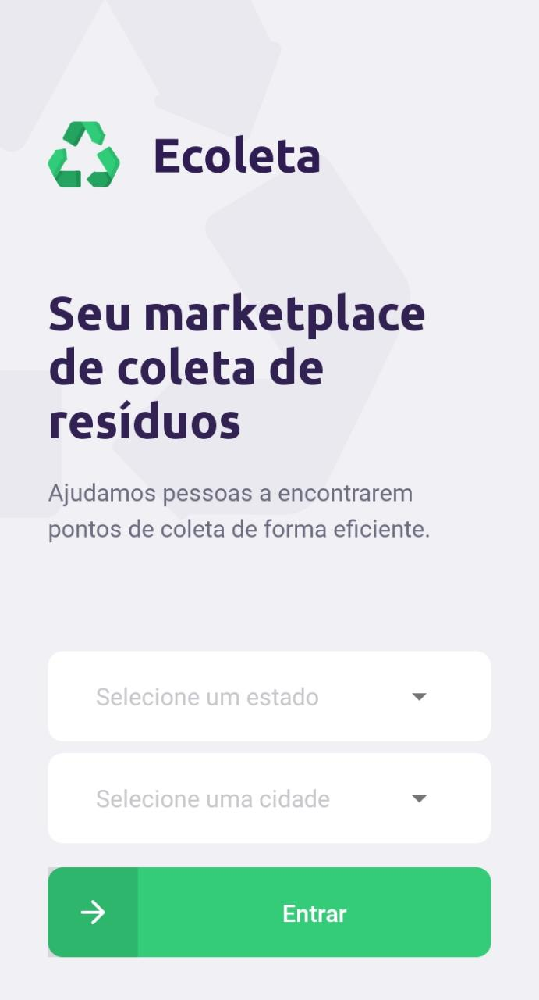
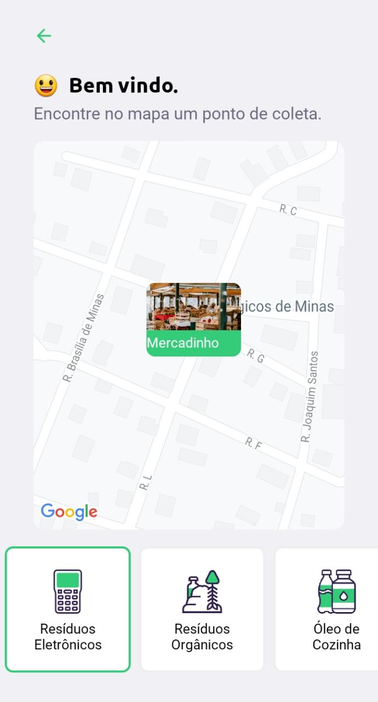
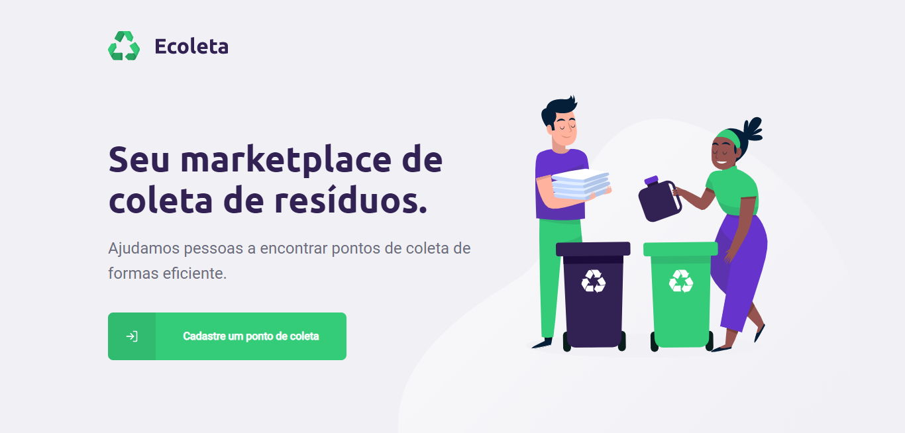
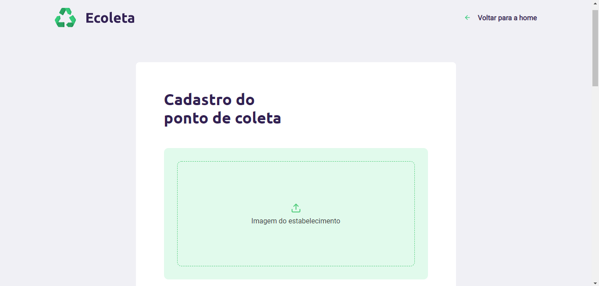
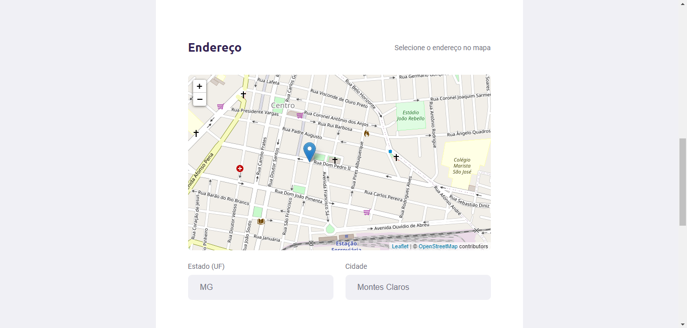
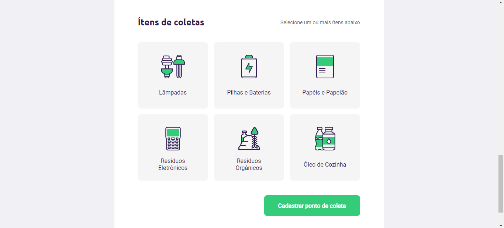

<div align="center">

  
  
  <br/><br/>
  
  <p>Project carried out during the <b>Next Level Week #01</b></p>

</div>

<br>

<p align="center">
  <a href="#demo">Demo</a>&nbsp;&nbsp;&nbsp;|&nbsp;&nbsp;&nbsp;
  <a href="#techs">Technologies</a>&nbsp;&nbsp;&nbsp;|&nbsp;&nbsp;&nbsp;
  <a href="#running-locally">Running locally</a>
</p>

<br>


<h2 id="demo"> Demo </h2>

Mobile:

<div align="center">
  &nbsp;&nbsp;&nbsp;&nbsp;&nbsp;&nbsp;
  &nbsp;&nbsp;&nbsp;&nbsp;&nbsp;&nbsp;
  
</div>

Web:



___



___



___



<h2 id="techs"> Technologies </h2>

This project was developed with the following technologies:

### backend:
- [Node.js](https://nodejs.org/en/docs/) with [Typescript](https://www.typescriptlang.org/)
- [SQLite](https://www.sqlite.org/index.html) with [Knex](http://knexjs.org/)
- [Express](https://expressjs.com/)
- [Multer](https://www.npmjs.com/package/multer)
- [Celebrate](https://www.npmjs.com/package/celebrate)
- [Cors](https://github.com/expressjs/cors)

### web:
- [ReactJS](https://reactjs.org/) with [Typescript](https://www.typescriptlang.org/)
- [React Leaflet](https://react-leaflet.js.org/)
- [Leaflet](https://leafletjs.com/)
- [React Dropzone](https://react-dropzone.js.org/)
- [Axios](https://github.com/axios/axios)

### mobile:
- [React Native](https://reactnative.dev/) with [Expo](https://docs.expo.io/) and [Typescript](https://www.typescriptlang.org/)
- [React Navigation v5](https://reactnavigation.org/)
- [Axios](https://github.com/axios/axios)
- [React Native Picker Select](https://www.npmjs.com/package/react-native-picker-select)
- [Expo Location](https://docs.expo.io/versions/latest/sdk/location/)
- [React Native SVG](https://docs.expo.io/versions/latest/sdk/svg/)
- [Expo Google Fonts](https://github.com/expo/google-fonts)
- [Mail Composer](https://docs.expo.io/versions/latest/sdk/mail-composer/)
- [Map View](https://docs.expo.io/versions/latest/sdk/map-view/)

<h2 id="running-locally"> Running locally </h2>

From your command line:
```sh
# backend
> npm install
> npm run dev

# web and mobile
> npm install
> npm start
```

Replace the ip of the ```'image_url'``` in the ``ItemsController.ts`` and ``PointsController.ts`` files with your machine's ip.

<i>( it is not possible to use localhost as the Expo is not found ).</i>
